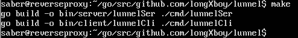
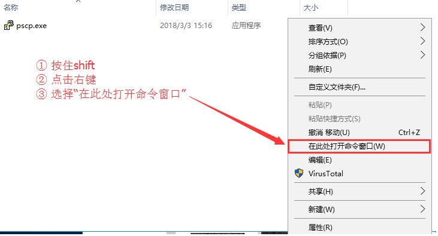
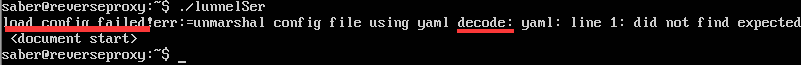

# 基于内网穿透使用无公网主机开服的实现
## Prologue.序言

总所周知，服务器要提供服务，必须要暴露一些端口到公网。就好比你要和一个人交♂易，你总得碰着他才行，对吧？

说到碰到主机，这里有几个思路：直接暴露到公网，代理，反向代理。

为了方便说明，我们打个比方：想象有一个神奇的国度，国度里住着三个神奇的大魔法师，他们分别掌握着各种神奇的魔术，而且都很愿意将这些魔术传授给本国的居民。这时候，某Artoria想向这三位大师学习一点简单的魔术，她便向邻居询问如何才能找到这三位大师，邻居告诉她：

* 大师1特别坐不住。总喜欢在大街上游荡，在自己家门口就可能遇见他
* 大师2是个死宅，总喜欢宅在家里面，想找他，得去他家里面。
* 大师3很害怕与外界事物直接接触，他总是把自己关在家里面。若你想找他，得通过他的信使转述才行。


按照这三个大师的特点，Artoria决定了向他们请教的办法：

* 对于大师1，搞不好在家门口都能直接撞到他，直接乘机请教就好。
* 对于大师2，可以跑到他家里去请教他。
* 对于大师3，可以由他的信使转达请教的内容。

在这个例子中，如果把大师们看作服务器，同时将Artoria看作客户端，那么便会是这样一幅图景：

* 服务器1（大师1）将自己**暴露在公网**（大街）上，任何一个客户端（Artoria）都可以直接和他通讯（请教问题）。
* 服务器2（大师2）处在本地网（宅在家）中，客户端（Artoria）要想与它通信（请教问题），需要通过**代理**进入内网（跑到他家里）。
* 服务器3（大师3）也处在本地网（宅在家）中，客户端（Artoria）要想与它通信，需要一台中转服务器（大师3的信使）将请求（请教的内容）**反向代理**到服务器3上。

在这三个服务器中，第一个服务器的设计是最简单，也是最高效的。在整个通信过程当中，只有服务器本身与客户端直接通信。如果可行的话，推荐大家都采用这种方法开服。但受限于我锅特色宽带基本不提供将计算机暴露到公网的服务，我们只得另寻僻径。

在本教程中，我们主要通过[lunnel](https://github.com/longXboy/lunnel)来还原服务器3的方案

在这篇教程开始之前，我们先来看看我们需要一些什么：

* 一台处于公网的服务器（最好高带宽，不要流量计费）
  整个服务器的流量基本都跑在这上面，其带宽需要2倍于正常开服时所用的带宽。

  最好linux系统且最好是debian系。。。没有apt的世界真的是一片黑暗。。。下面的教程也会采用debian系作为演示教学

* 服务端

因为我没有这么多计算机，所以我将用几台虚拟机来模拟出同样的效果。大概如下：

```
有两台虚拟机，分别命名为server,reverseproxy
server,就是处于内网中的服务器。
reverseproxy,就是中转服务器。
至于Artoria去哪了。。。那就是我的物理机啦。。。
三台机器的用户名都是saber(月厨guna!)
```

注：为了防止混淆两台服务器，我们约定放在公网中的那台，也就是扮演**"信使"**角色的那一台称为**信使服务器**，而位于本地的那台，也就是扮演**"大师3"**角色的那一台称为**主服务器**。

准备好了么？

## Chapter.1 配置信使服务器

### 1.登陆信使服务器

(这个就不用我教了吧。。。什么putty,xshell都行)


### 2.更新软件源并安装一些必要的软件:

```bash
sudo apt-get update
```


在使用sudo命令时，可能需要输入密码。

若提示"[sudo] password for <用户名>："，请输入当前用户的密码

*注：密码不会显示出来（连星号都没有）。使劲输就对了*

```bash
sudo apt-get install golang git screen nano make  -y
```


### 3.下载编译lunnel.

```bash
git clone https://github.com/longXboy/lunnel.git
```


重建目录结构,切换到构建目录。

```bash
mkdir go
mkdir go/src
mkdir go/src/github.com
mkdir go/src/github.com/longXboy
mv -rf lunnel go/src/github.com/longXboy/
export GOPATH=$(pwd)
cd go/src/github.com/longXboy/lunnel
```

开始编译。

```bash
make
```



*对，就这么短！*

将编译出来的程序丢到一个目录里。

```bash
cp -rf bin ~/lunnelbin
```

现在已经编译好了lunnel的服务端与客户端。

如果你的主机与信使服务器架构，系统，位数都相同的话，那么你可以直接把编译出来的客户端传到主服务器上使用。请执行以下命令，并跳至下方"4.配置lunnel服务端"

```bash
cp -rf ~/lunnelbin/client ~/client
tar czvf ~/client.tar.gz -C ~/ client/
```

否则。。。我们需要使用一种名为交叉编译的科技。

>A **cross compiler** is a [compiler](https://en.wikipedia.org/wiki/Compiler) capable of creating [executable](https://en.wikipedia.org/wiki/Executable) code for a [platform](https://en.wikipedia.org/wiki/Platform_(computing)) other than the one on which the compiler is running. For example, a compiler that runs on a [Windows 7](https://en.wikipedia.org/wiki/Windows_7) [PC](https://en.wikipedia.org/wiki/Personal_computer) but generates code that runs on [Android](https://en.wikipedia.org/wiki/Android_(operating_system)) [smartphone](https://en.wikipedia.org/wiki/Smartphone) is a cross compiler.
>
>---Wikipedia,CC-BY-SA 3.0

请先按照以下模板填空，然后复制到信使服务器终端：

```bash
GOOS=<请填空1> GOARCH=<请填空2> make
```

将<请填空1>按照以下规则替换：

```
若你的主服务器的系统为windows，请填空windows
若你的主服务器的系统为linux，请填空linux
若你的主服务器的系统为Mac os(OSX)，请填空drawin
```

将<请填空2>按照以下规则替换：

```
若你的主服务器cpu是龙芯，请收下我的膝盖并填空mips64le
若你的主服务器为32位，请填空386
若你的主服务器为64位，请填空amd64
```

~~一个回车下去瞬！间！爆！炸！~~执行代码。


复制并整理客户端。

```bash
cp -rf bin/client ~/client
tar czvf ~/client.tar.gz -C ~/ client/
```


### 4.配置lunnel服务端

回到主目录,复制一份服务端,切换到服务端目录:

```
cd ~
cp -rf lunnelbin/server .
cd server
```

用文本编辑器(我使用的是nano编辑器)新建并编辑配置文件：

```bash
nano config.yml
```

进入后，复制以下模板：

```yaml
server_domain: <请填空1>
port: <请填空2>
http_port: <请填空3>
https_port: <请填空4>
aes:
  secret_key: <请填空5>
health:
  interval: 15
  timeout: 40
```

按照以下规则填空：

```
将<请填空1>替换为信使服务器的域名。如果没有域名的话请把整行删去。
将<请填空2>替换为信使服务器的连接端口(＞1，＜65535，尽量大一些。）
将<请填空3>替换为信使服务器的http(网页)端口(＞1，＜65535，尽量大一些。）
将<请填空4>替换为信使服务器的https(加密网页)端口(＞1，＜65535，尽量大一些。）
将<请填空5>替换为你想使用的密码（用于加密，可以复杂一些）并将密码记录下来。
注意：2,3,4不能重复！
```

替换好后大概是这个样子↓


保存并退出编辑器（如果你也用nano，请按Ctrl-X 然后按Y,然后按回车）

启动一次做测试：

```bash
./lunnelSer
```

如果启动后大概长这个样子↓，说明配置无误！


如果出现错误，请参考附录1。

### 5.启动服务端：

在后台运行这玩意有两种方式：

* 丢进一个screen里面
* 直接丢到后台里。

第一种方式适用于你没事想把服务端捞出来看看长啥样了，而第二种方式适用于你就想让服务端跑，并不想管他。

对于第一种方法：

```bash
screen -S lunnel
./lunnelSer
```

然后按住ctrl，按A，放开A，按D，放开D，放开ctrl,完成。

以后想捞出来的时候，输入以下指令：

```bash
screen -r lunnel
```

再把它丢回去的方法和上面说的（按住ctrl，按A，放开A，按D，放开D，放开ctrl）一样。


对于第二种方法：

```bash
nohup ./lunnelSer &
```

完成，以后想关闭它的时候直接

```bash
killall lunnelSer
```


## Chapter.2 配置主服务器

### 1.若你的主服务器是linux系统:

先在主服务器上下载一份客户端

请在主服务器上输入以下指令：

```bash
scp <信使服务器用户名>@<信使服务器ip>:~/client.tar.gz client.tar.gz
```


下载完成后进行解压并切换进客户端目录：

```bash
tar xzvf client.tar.gz
cd client
```

用文本编辑器(我又使用了nano编辑器)新建并编辑配置文件：

```bash
nano config.yml
```

复制以下模板：

```yaml
server_addr: <请填空1>:<请填空2>
tunnels:
  mcserver:
    schema: tcp
    port: <请填空3>
    local: 127.0.0.1:<请填空4>
encrypt_mode: aes
aes:
  secret_key: <请填空5>
enable_compress: true
transport: mix
health:
  interval: 15
  timeout: 40
```

按照以下规则填空

```
将<请填空1>替换为信使服务器的ip
将<请填空2>替换为信使服务器的连接端口(上面写过的那个)
将<请填空3>替换为想让玩家连接游戏的端口,minecraft默认为25565
将<请填空4>替换为本地游戏服务端的端口,minecraft默认为25565
将<请填空5>替换为上面记下来的密码
```

替换好后大概是这个样子：


保存并退出编辑器（如果你也用nano，请按Ctrl-X 然后按Y,然后按回车）

启动一次做测试：

```
./lunnelCli
```

如果启动后大概长这个样子↓，说明配置无误！


如果出现错误，请参考附录1。

接着把它用上方提到的方式丢到后台，启动游戏服务端，跳转到Chapter.3吧!


### 2.若你的主服务器是Windows系统:

先在主服务器上下载pscp:https://the.earth.li/~sgtatham/putty/latest/w32/pscp.exe  将其复制到你想安装lunnel的位置，然后按住shift,点击右键，选择“在此处打开命令窗口”



然后在打开的命令提示符中输入：

```
pscp <信使服务器用户名>@<信使服务器ip>:/home/<信使服务器用户名>/client.tar.gz client.tar.gz
```


解压client.tar.gz,进入client目录

将lunnelCli文件重命名，在后面添加“.exe”后缀名


用文本编辑器(我使用notepad++编辑器)新建并编辑配置文件

复制以下模板：

```yaml
server_addr: <请填空1>:<请填空2>
tunnels:
  mcserver:
    schema: tcp
    port: <请填空3>
    local: 127.0.0.1:<请填空4>
encrypt_mode: aes
aes:
  secret_key: <请填空5>
enable_compress: true
transport: mix
health:
  interval: 15
  timeout: 40
```

按照以下规则填空

```
将<请填空1>替换为信使服务器的ip
将<请填空2>替换为信使服务器的连接端口(上面写过的那个)
将<请填空3>替换为想让玩家连接游戏的端口,minecraft默认为25565
将<请填空4>替换为本地游戏服务端的端口,minecraft默认为25565
将<请填空5>替换为上面记下来的密码
```

保存该配置文件为config.yml(在保存时将保存类型设置为所有文件，在文件名处填写config.yml)

按照以上操作执行以后，大概是这个样子的↓


启动一次做测试.如果启动后大概像这样↓，说明配置无误！

如果出现错误，请参考附录1。

启动游戏服务端,然后,,,,,,


## Chapter.3 测试

尝试让客户端连接信使服务器。。。


如果成功连入，说明成功了！


## Appendix.附录

### 1. 报错的处理方法

人在代码飘，哪有不报错？既然爆了错，干脆补个漏！

还是先来看看报错内容，对症下药


报错1：端口被占用


关键词："bind:address already in use"

解决方法：在配置文件中换一个端口


报错2：文件不存在


关键词："no such file or directory"

解决方法。。。口恩。。。检查文件名。。。。如果是windows系统，请特别注意检查扩展名是否为.yml


报错3：yml格式错误



关键词："load config failed","decode"

解决方法：检查一下yml格式是否有误。对于yml来说：


(每一项钱的空格数量必须严格把握，冒号之后必须跟空格或者直接换行！)


报错4：写错密钥


关键词："not match want"

解决方案：检查配置文件密码部分！


报错5：


关键词："permission denied"

解决方案：信使服务端使用1024以下的端口时需root权限。。。可以在启动命令前加sudo,或者将端口改为大于1024的值。


## Epilogue.后话

写这篇教程的时候是假期结束前的最后一天。

也算是做完了一件大事。。。？真是奇奇怪怪的总结啊。

还有，才没有neta 信使RNA呢！


这篇教程到这里就结束了。个人语文能力不好，如果有看不懂/需要补充的地方，欢迎回复或向我的邮箱发信([inapp@iccmc.cc](mailto:inapp@iccmc.cc))，谢谢！
