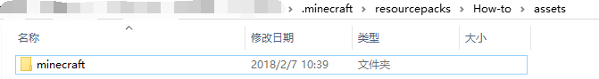
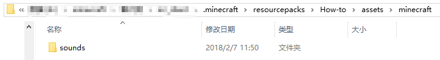
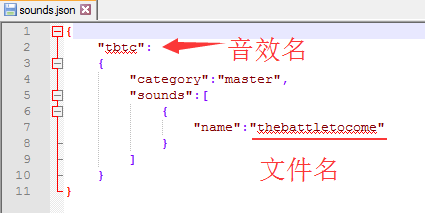
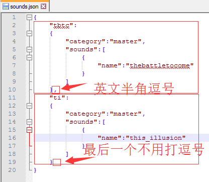

# 如何制作音效资源包

大家都知道，音乐可以用于渲染故事的气氛。所以，一些mc的地图中，会内置音乐或是音效。这篇博文将以置入[the battle to come](https://music.163.com/song?id=22731452)为例，讨论如何用资源包的形式，将音乐放入你的资源包中。

## 1.建立目录结构

首先，请在游戏的资源包文件夹(.minecraft/resourcepacks)中，创建一个文件夹来容纳资源包的内容。文件夹的名字可以自己选择，它决定下图中红框的文字。*本教程中文件夹名为How-to。*


然后，在你新建立的文件夹中，创建一个名为assets的文件夹，在assets文件夹中，创建minecraft文件夹，在minecraft文件夹中，创建sounds文件夹。建立好的文件夹应如下图所示：


*新建立的文件夹*



*assets文件夹*



*minecraft文件夹*

这样，目录结构就建立好了。

## 2.创建资源包的描述及图片

这一节的内容，主要是为了添加描述与图片，如图所示


*黄框为描述，绿框为图片*

### (1)创建pack.mcmeta文件

在你最开始新建立的那个文件夹(就是本教程里为How-to的那个文件夹)里，创建一个文件，命名为pack.mcmeta.请注意：文件的后缀名是mcmeta，如果你在命名后没有出现如图所示对话框：


那么请点击windows资源管理器的“查看”标签，将"文件扩展名"勾上，然后删去多余的扩展名即可(本例中为.txt)，如图所示。


接下来,用你喜欢的文本编辑器打开该文件，复制以下代码。

```json
{
   "pack": {
      "pack_format": <请填空1>,
      "description": "<请填空2>"
   }
}
```

**注意！代码是由JSON写成的，如果缺少{",:这些符号，资源包可能根本无法运行！**我个人建议直接复制代码，而不是打字。

将<请填空1>按照以下规则替换：

```
如果你的游戏版本为1.6至1.8,请替换为1
如果你的游戏版本为1.9至1.10,请替换为2
如果你的游戏版本为1.11至1.12,请替换为3
如果你的游戏版本为1.13,请替换为4
```

将<请填空2>替换为你对本资源包的描述。

替换后的文件应类似下图:


*注：替换的时候记得把尖括号也替换掉。*

保存并关闭该文件。

### (2)添加图标(可选)

将你想用作资源包图标的图片用图片处理软件打开，调整为长宽128*128，保存为png格式图片，将保存后的图片复制到最开始新建的那个文件夹，改名为pack.png。如图所示


现在，若你打开游戏，应该能看到新的材质包了。

## 3. 引入声音

这一节是全文的重点。主要是为了提供音频文件，并告诉minecraft音频文件在哪里.

### (1) 复制音频文件

首先，将音频文件转换为ogg格式。我使用了在线转换器。传送门-->[在线转换](https://audio.online-convert.com/convert-to-ogg)

转换好以后，将音频重命名为英文、全小写的名字。放在sounds文件夹内。如图：


### (2) 创建sound.json文件

进入minecraft文件夹(于资源包中，在assets文件夹里)，创建sounds.json(依旧要注意扩展名)。用你喜欢的文本编辑器打开该文件，复制以下代码：

```json
{
	"<请填空3>":
	{
		"category":"master",
		"sounds":[
			{
				"name":"<请填空4>"
			}
		]
	}
}
```

将<请填空3>替换为你想使用的音效名（/playsound指令中的第一个参数）。

将<请填空4>替换为你复制的音频文件文件名，**不带扩展名**。（如我想使用thebattletocome.ogg,该空应填thebattletocome）

*注：替换的时候记得把尖括号也替换掉。*

替换之后的效果应类似于这样：



保存并关闭该文件。

## 4.测试

启动minecraft.我建议打开启动器的游戏日志窗口(在HMCL中，可以点击游戏设置标签的查看日志按钮。)，或者用调试模式启动游戏。

先应用资源包，查看一下日志窗口。

这里列举一个常见的错误


*找不到文件。请确认文件名(或文件夹名)是否正确*

如果应用资源包没有出现错误的话，便可以进入一个世界，在其中执行如下命令：

```
/playsound <音效名> master @a
```

若你能听到音效，说明。。。成功了！


## 5.其他可能有用的东西

### (1).添加多个音频的办法

先按照3.(1)的方法，将音频复制进sounds文件夹，然后在sounds.json文件内倒数第二行的反大括号后面打一个逗号(英文半角)，换行，复制一份以下内容，按照上方的规则填空：

```json
	"<请填空3>":
	{
		"category":"master",
		"sounds":[
			{
				"name":"<请填空4>"
			}
		]
	}
```

*其实和上面的模板没什么不一样，只是少了个开头和结尾的大括号罢了。*

填空后大概成这个样子：



使用方法不变。


本篇教程就到这里了。若有看不懂/表述不好的地方，欢迎给我发邮件/issue。地址：

邮箱：inapp@iccmc.cc

issue:https://github.com/inapp123/inapp123.github.io/issues

